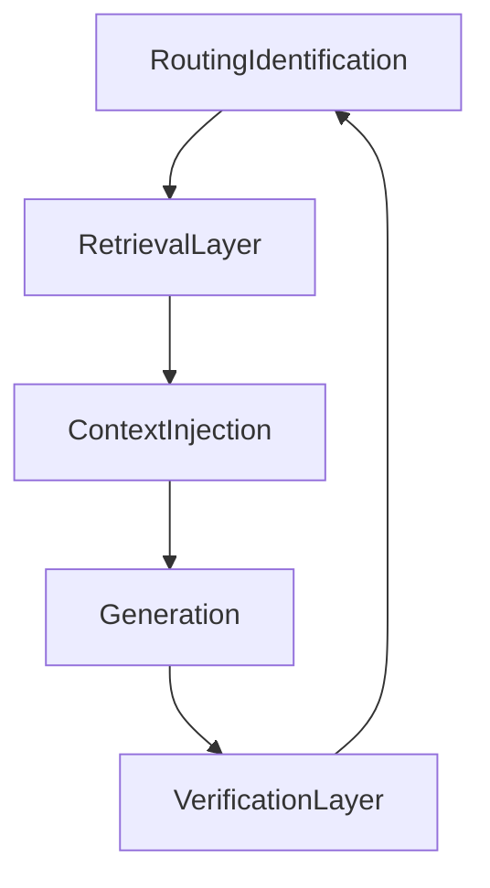

## Grounding pipeline (Routing → Retrieval → Injection → Generation → Verification)

This is the **5-step grounding pipeline** that makes LLM outputs auditable and resistant to fabricated repositories/APIs/data.

### Step 0 (inputs)
- **User input** (free text / uploads / device signals)
- **Current trunk** (1.0–9.0)
- **Session state**: `ContextGraph` revision + receipts
- **Patient baseline**: `PatientKnowledgeGraph` revision + receipts

### Step 1: Routing / Identification
Goal: determine which **grounding obligations** apply.

Routing produces a `GroundingPlan`:
- `needs_static_docs`: which topics must be cited (e.g., “Choosing Wisely”, “red-flag questions”)
- `needs_live_calls`: which operational facts must come from tools (IHI, SNOMED/ICD, delivery receipts)
- `needs_structured_kg`: which registries/templates are required (Axis B templates, benign registry)

### Step 2: Retrieval layer (MCP tool calls)
Goal: retrieve only from approved sources.

Allowed retrieval classes:
- Static docs: `docs.search/get/cite`
- Structured knowledge: `kg.query/provenance`
- Live operational: `identity-*`, `terminology`, `fhir-*`, `pharm.*`, `msg.*`, `geo.*`, `pharmacy.*`

Retrieval output must include **proof artifacts**:
- Static docs: `citation_id` (+ version/date)
- Live calls: `receipt` with `request_id`, `timestamp_utc`, `upstream`, `mode`
- Structured datasets: `dataset_version` (+ checksums where applicable)

### Step 3: Context injection (bounded packet)
Goal: assemble a **minimal context packet** that the LLM can use without inventing anything.

Recommended packet shape:
- `facts`: only what is needed for the next step (no raw lab numbers unless already sanitized)
- `evidence`: list of `EvidenceNode` objects linking every critical fact to proofs
- `constraints`: trunk-specific forbidden behaviors (e.g., “no diagnosis”, “no dosages”)
- `receipts`: tool receipts required for verification

### Step 4: Generation
Goal: generate output *only within the contract*.

Rules:
- The model may produce **explanations**, **question prompts**, and **routing payloads**, but must not create facts that belong to Live Data or Structured Knowledge.
- Any mention of SNOMED/ICD, guideline recommendations, or operational state must be derived from injected evidence.

### Step 5: Verification layer (hard gates)
Goal: mechanically reject hallucinations.

Verification checks (minimum):
1. **No invented codes**: any `SNOMED_CT_Code` / `ICD_11_Code` requires a `terminology.lookup` receipt.
2. **No invented guidelines**: any “Choosing Wisely/eTG says …” claim requires a `docs.cite` ID.
3. **No invented operations**: any claims about IHI, lab results, pharmacy availability, or delivery must include a live-data receipt.
4. **No repo/API invention**: output must not introduce new internal repo names or pretend an API exists; references must map to the gap register or known MCP servers.
5. **Hard-stop enforcement**: `HARD_FAIL` from pharmacology or “critical acuity override” from investigations must block progression.

Artifacts produced each run:
- `verification/report.json`: machine-readable pass/fail + reasons + missing receipts
- `verification/evidence_tree.md`: human-readable mapping from claims → proofs

### Diagram

