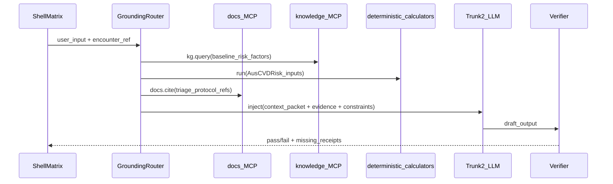
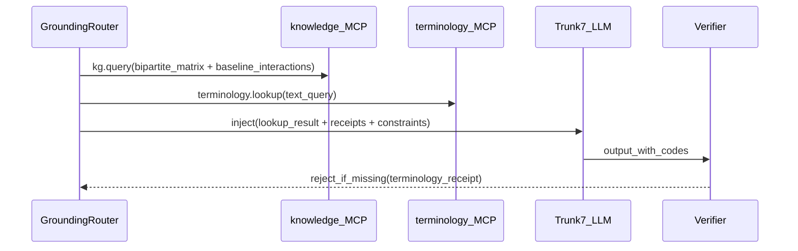

## Sequence diagrams (grounding-centric)

### Trunk2_Triage_with_grounding

```mermaid
sequenceDiagram
  participant Shell as ShellMatrix
  participant Router as GroundingRouter
  participant Docs as docs_MCP
  participant KG as knowledge_MCP
  participant Calc as deterministic_calculators
  participant LLM as Trunk2_LLM
  participant Ver as Verifier

  Shell->>Router: user_input + encounter_ref
  Router->>KG: kg.query(baseline_risk_factors)
  Router->>Calc: run(AusCVDRisk_inputs)
  Router->>Docs: docs.cite(triage_protocol_refs)
  Router->>LLM: inject(context_packet + evidence + constraints)
  LLM->>Ver: draft_output
  Ver-->>Shell: pass/fail + missing_receipts
```

### Trunk7_Code_lockin_requires_terminology_receipt

```mermaid
sequenceDiagram
  participant Router as GroundingRouter
  participant KG as knowledge_MCP
  participant Term as terminology_MCP
  participant LLM as Trunk7_LLM
  participant Ver as Verifier

  Router->>KG: kg.query(bipartite_matrix + baseline_interactions)
  Router->>Term: terminology.lookup(text_query)
  Router->>LLM: inject(lookup_result + receipts + constraints)
  LLM->>Ver: output_with_codes
  Ver-->>Router: reject_if_missing(terminology_receipt)
```

